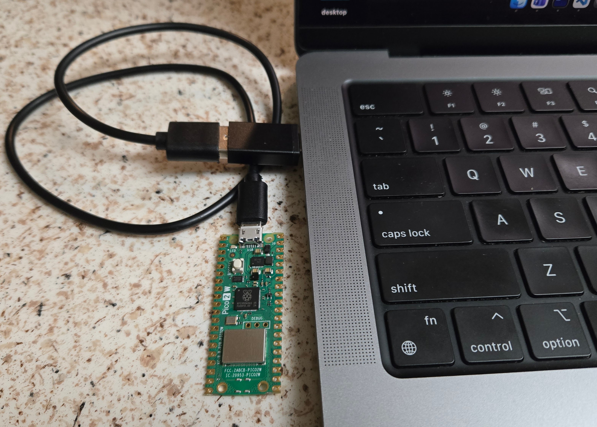
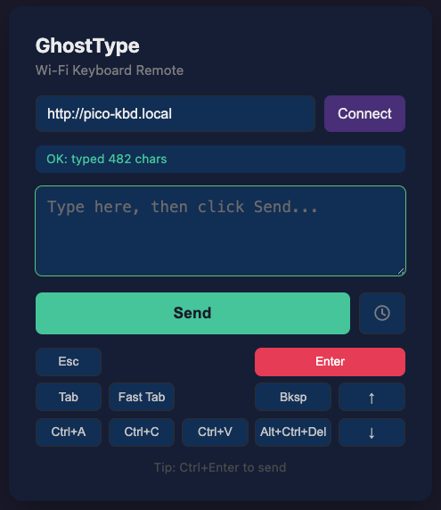

# GhostType

**Wi-Fi controlled USB keyboard emulator using Raspberry Pi Pico 2W.**

GhostType turns a ~$7 Pico 2W into a remote keyboard. Plug it into any computer via USB — it appears as a standard keyboard. Send keystrokes to it over Wi-Fi from another machine using simple REST API calls.

The target computer needs **no software installed**. It only sees a normal USB keyboard.

```
  Your Computer                    Target Computer
       |                                 |
       | Wi-Fi (REST API)                | USB cable
       v                                 v
    +---------------------------------+
    |      Raspberry Pi Pico 2W       |
    |         running GhostType       |
    +---------------------------------+
```

## Use Cases

- Control a locked-down PC that doesn't allow software installation
- Remote typing/automation on air-gapped machines
- Send keyboard shortcuts to a headless system
- Automate repetitive typing tasks on any computer

## Hardware Required



### Raspberry Pi Pico 2W (< $7)

| Spec | Value |
|------|-------|
| CPU | RP2350 dual-core Arm Cortex-M33 @ 150 MHz |
| Architecture | Selectable Arm Cortex-M33 or Hazard3 RISC-V |
| RAM | 520 KB SRAM |
| Flash | 4 MB |
| Wi-Fi | 2.4 GHz 802.11b/g/n |
| Bluetooth | 5.2 |
| GPIO | 26 pins (3 ADC-capable) |
| USB | Native USB 1.1 (Host/Device) |
| Security | Arm TrustZone, signed boot, hardware TRNG |

### What You Need

| Item | Purpose |
|------|---------|
| [Raspberry Pi Pico 2W](https://www.raspberrypi.com/products/raspberry-pi-pico-2/) (< $7) | Microcontroller with Wi-Fi |
| USB cable (Micro-USB) | Connect Pico to target computer |
| Any computer with Wi-Fi | Send commands via REST API |

## Quick Start

### 1. Flash CircuitPython

1. Hold **BOOTSEL** on the Pico 2W and plug it into your computer
2. A drive named **RP2350** appears
3. Download [CircuitPython 10.x for Pico 2W](https://circuitpython.org/board/raspberry_pi_pico2_w/)
4. Copy the `.uf2` file to the RP2350 drive
5. The Pico reboots and a **CIRCUITPY** drive appears

### 2. Install Libraries

Download the [CircuitPython 10.x Library Bundle](https://circuitpython.org/libraries) and copy these folders to `CIRCUITPY/lib/`:

- `adafruit_hid/`
- `adafruit_httpserver/`

### 3. Deploy GhostType

Copy the firmware files to the CIRCUITPY drive:

```bash
# Copy the application code
cp firmware/code.py /Volumes/CIRCUITPY/
cp firmware/boot.py /Volumes/CIRCUITPY/

# Create your Wi-Fi config
cp firmware/settings.toml.example /Volumes/CIRCUITPY/settings.toml
```

Edit `CIRCUITPY/settings.toml` with your Wi-Fi credentials:

```toml
CIRCUITPY_WIFI_SSID = "YourNetworkName"
CIRCUITPY_WIFI_PASSWORD = "YourPassword"
```

### 4. Connect and Use

1. Plug the Pico 2W into the **target computer** via USB
2. GhostType connects to Wi-Fi and starts the REST server
3. It is reachable at **http://pico-kbd.local** (via mDNS) or by IP address

## API Reference

### Health Check

```bash
curl http://pico-kbd.local/
# => GhostType Ready - IP: 10.0.0.141
```

### Type Text

```bash
curl -X POST http://pico-kbd.local/type \
     -d '{"text":"Hello World"}'
```

### Press a Key

```bash
curl -X POST http://pico-kbd.local/keypress \
     -d '{"key":"ENTER"}'
```

### Key Combination

```bash
curl -X POST http://pico-kbd.local/combo \
     -d '{"keys":["CONTROL","C"]}'
```

## Web Interface

GhostType includes a browser-based remote control. Just open `client/ghosttype.html` in any browser — no install needed. Works on Windows, Mac, Linux, and even phones.



Features:
- Connect to the Pico by hostname or IP
- Text box for typing strings
- Quick buttons for Enter, Tab, Esc, Backspace, arrows
- Shortcut buttons for common combos (Ctrl+A, Ctrl+C, Ctrl+V, Alt+Tab)
- Ctrl+Enter keyboard shortcut to send

To use: open the file in your browser, click **Connect**, type your text, and hit **Send**.

## CLI Client

A convenience shell script is included:

```bash
# Check status
./client/ghosttype.sh status

# Type text
./client/ghosttype.sh type "Hello World"

# Press a key
./client/ghosttype.sh key ENTER

# Key combo (Ctrl+A)
./client/ghosttype.sh combo CONTROL A
```

Set `GHOSTTYPE_HOST` to override the default hostname:

```bash
export GHOSTTYPE_HOST=10.0.0.141
```

## Available Keys

Common key names for `/keypress` and `/combo`:

| Category | Keys |
|----------|------|
| Modifiers | `CONTROL`, `SHIFT`, `ALT`, `GUI` (Win/Cmd) |
| Navigation | `ENTER`, `TAB`, `ESCAPE`, `BACKSPACE`, `DELETE`, `SPACE` |
| Arrows | `UP_ARROW`, `DOWN_ARROW`, `LEFT_ARROW`, `RIGHT_ARROW` |
| Function | `F1` through `F12` |
| Letters | `A` through `Z` |

Full list: [Adafruit HID Keycode Reference](https://docs.circuitpython.org/projects/hid/en/latest/api.html#adafruit_hid.keycode.Keycode)

## Project Structure

```
ghosttype/
├── firmware/
│   ├── code.py                  # Main application (REST server + HID keyboard)
│   ├── boot.py                  # USB HID configuration (keyboard-only mode)
│   └── settings.toml.example    # Wi-Fi credentials template
├── client/
│   ├── ghosttype.html           # Browser-based remote control
│   └── ghosttype.sh             # CLI client for sending commands
├── docs/
│   ├── images/
│   │   ├── rpi-pico2w.jpg
│   │   └── ghosttype-sample-interface.png
│   └── pico_w_rest_keyboard_howto.md  # Detailed technical guide
├── LICENSE
└── README.md
```

## How It Works

1. **boot.py** runs at power-on and configures the Pico to appear as a USB keyboard only (disabling storage and serial)
2. **code.py** connects to Wi-Fi, advertises `pico-kbd.local` via mDNS, and starts an HTTP server on port 80
3. When a REST request arrives (e.g. `POST /type`), the Pico sends the corresponding USB HID keystrokes
4. The target computer receives them as normal keyboard input

## Important Notes

### Why boot.py Is Required

Without `boot.py`, the Pico presents itself as a USB storage device, serial console, MIDI device, **and** a keyboard. Some computers (especially Windows with endpoint protection) will **block the device as malware** when they see a USB drive auto-mounting.

With `boot.py` deployed, the Pico appears as **only a standard USB keyboard** — nothing else. No storage, no serial, no flags.

### Development Mode vs Production Mode

**Development** (editing files on the Pico):
- Do **not** deploy `boot.py`
- The CIRCUITPY drive stays visible so you can edit `code.py` and `settings.toml` directly
- Plug into your Mac only

**Production** (plugged into target PC):
- Deploy `boot.py` to the CIRCUITPY drive
- Unplug and re-plug the Pico (no need to hold BOOTSEL)
- The target PC will only see a keyboard

### Recovering from boot.py (BOOTSEL Reset)

Once `boot.py` is active, the CIRCUITPY drive is hidden. To edit files again:

1. **Unplug** the Pico from any computer
2. **Hold the BOOTSEL button** (the larger button on the board)
3. **While holding it**, plug the USB cable into your Mac
4. **Release** the button — a drive called **RP2350** appears
5. Copy the CircuitPython `.uf2` firmware file to the RP2350 drive
6. The Pico reboots and the **CIRCUITPY** drive reappears with all your files intact

This always works regardless of what software is on the device — BOOTSEL is a hardware-level recovery built into the RP2350 chip.

**The board has two buttons:**

| Button | Purpose |
|--------|---------|
| **BOOTSEL** (larger) | Hold while plugging in to enter bootloader recovery mode |
| **RUN** (smaller) | Reboots the Pico (does NOT bypass boot.py) |

### mDNS Hostname

The default hostname is `pico-kbd.local`. To change it, edit the `mdns_server.hostname` line in `code.py`. The hostname **must contain a hyphen** to work reliably with mDNS.

## Security Implications

GhostType is a powerful tool — it can type anything on any computer it's plugged into. Please understand the risks before using it, even on your home network.

### 1. No Authentication

The REST API has **zero authentication**. Anyone on the same Wi-Fi network can send keystrokes to the target computer without any password or token:

```bash
curl -X POST http://pico-kbd.local/type -d '{"text":"anything"}'
```

This includes guests on your Wi-Fi, compromised IoT devices, or any other device on the network.

### 2. Plaintext HTTP

All traffic between your computer and the Pico is **unencrypted HTTP**. Anyone sniffing your network can see exactly what you are typing through GhostType. The Pico does not have the resources to support HTTPS/TLS.

### 3. CORS Wildcard

The firmware uses `Access-Control-Allow-Origin: *` so that the browser-based client works. This means if you visit a **malicious website** from any device on your network, that website's JavaScript could silently send keystrokes to `pico-kbd.local` through your browser — without you knowing.

### 4. Wi-Fi Credentials on the Device

Your Wi-Fi password is stored in **plaintext** in `settings.toml` on the Pico's flash memory. Anyone with physical access to the Pico can hold BOOTSEL, re-flash CircuitPython, and read your Wi-Fi password.

### 5. No Rate Limiting

There is no throttling or rate limiting on the API. A malicious actor could flood the Pico with thousands of keypress requests.

### 6. The Target PC Cannot Distinguish GhostType from a Real Keyboard

The target computer sees a standard USB keyboard. There is no way for it to tell the difference between GhostType keystrokes and a human typing. Antivirus and endpoint protection will not flag the keystrokes.

### Recommendations

- **Use on a trusted/private network only** — your Wi-Fi password is the primary security barrier
- **Never expose to the internet** — GhostType should only be reachable on your local network
- **Be aware of physical access risks** — anyone who can touch the Pico can read your Wi-Fi credentials
- **Consider adding an API token** — modify `code.py` to check for a secret header or query parameter before accepting commands
- **Disconnect when not in use** — unplug the Pico from the target computer when you don't need it

## License

MIT - See [LICENSE](LICENSE) for details.
